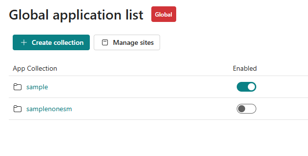
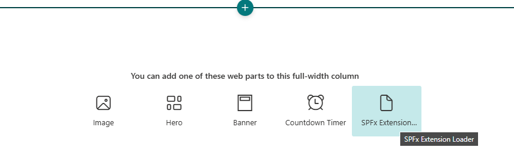
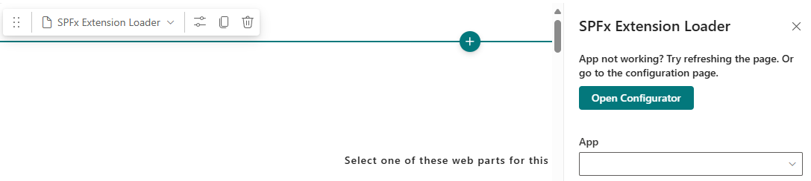
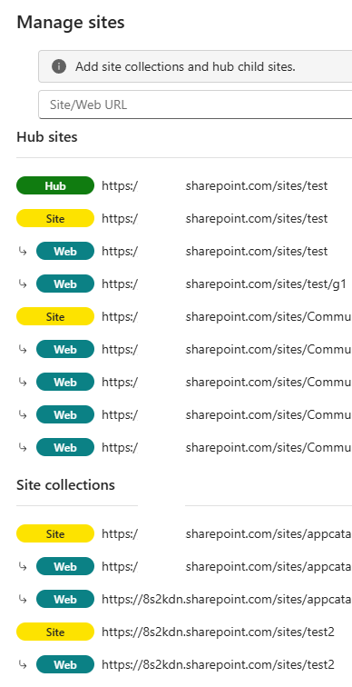
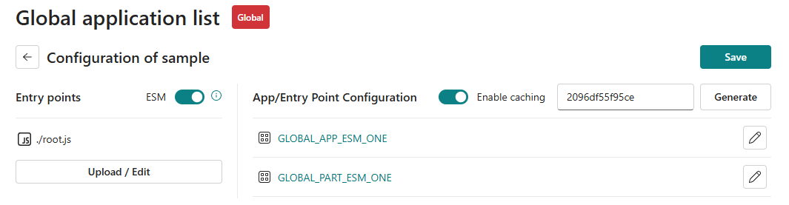
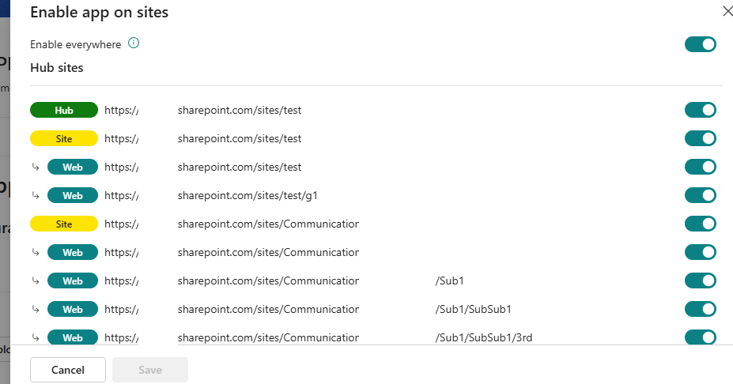

# SPFx Extensions Framework

## Summary

A SharePoint Framework (SPFx) extension solution that provides a framework-agnostic wrapper for building modern SharePoint applications. This solution contains both a web part and an application customizer that can be installed tenant-wide, enabling developers to break free from the traditional SPFx ecosystem limitations.

The solution acts as a wrapper around the `@spfx-extensions/core` package, allowing you to use any modern bundler (Bun, esbuild, Vite, etc.) and the latest Node.js versions for your SharePoint solutions.

## Used SharePoint Framework Version


## Applies to
- SharePoint Online

> Get your own free development tenant by subscribing to [Microsoft 365 developer program](http://aka.ms/o365devprogram)

## Prerequisites

- SharePoint Online tenant
- App Catalog site collection
- Global administrator or SharePoint administrator permissions for tenant-wide deployment
- Node.js 22.14.0 or higher (but less than 23.0.0)

## Disclaimer

**THIS CODE IS PROVIDED _AS IS_ WITHOUT WARRANTY OF ANY KIND, EITHER EXPRESS OR IMPLIED, INCLUDING ANY IMPLIED WARRANTIES OF FITNESS FOR A PARTICULAR PURPOSE, MERCHANTABILITY, OR NON-INFRINGEMENT.**

---

## Minimal Path to Awesome

### Installation

1. **Clone this repository**
   ```bash
   git clone https://github.com/SPWizard01/spfx-extensions
   cd spfx-extensions
   ```

2. **Install dependencies**
   ```bash
   npm install
   ```

3. **Build the solution**
   ```bash
   npm run build
   ```

4. **Package for deployment**
   ```bash
   npm run release
   ```
   If you would like to change the name of the webpart to use your own then use `--change-name` argument
   ```bash
   npm run release --change-name My Awesome Webpart
   ```

5. **Deploy to App Catalog**
   - Upload the generated `.sppkg` file from `./dist/deploy/` to your tenant's App Catalog
   - Deploy the solution tenant-wide when prompted
   - The solution will automatically create the required subsite and configuration infrastructure

### Post-Installation

After successful deployment, you can:

- Navigate to `/sites/appcatalog/SPFxExtensionsData/SitePages/SPFxExtensionsConfigurator.aspx` for global configuration

- Add the SPFx Extensions Loader web part to any SharePoint page

- Then configure which app the webpart should load

- Configure applications at different scopes (Global, Hub, Site, Web) as needed

- Add webs where you want to add the apps

- Configure the app/upload necessary files

- Enable or disable the app at specific scope
## Development Commands

| Command | Description |
| ------- | ----------- |
| `npm run build` | Build the solution in development mode |
| `npm run serve` | Start the local development server |
| `npm run release` | Build and package for production deployment |
| `npm run clean` | Clean build artifacts |
| `npm test` | Run tests |

## What This Solution Does

When deployed to your SharePoint tenant, this solution:

1. **Creates Infrastructure**: Automatically provisions a special subsite at `/sites/appcatalog/SPFxExtensionsData`
2. **Configuration Management**: Sets up application-specific configuration lists in the subsite
3. **Global Configuration Page**: Creates a configuration page at `SitePages/SPFxExtensionsConfigurator.aspx`
4. **Multi-Scope Support**: Enables configuration for Global, Hub, Site, and Web scoped solutions
5. **Framework Freedom**: Acts as a wrapper around `@spfx-extensions/core`, freeing you from SPFx ecosystem constraints

## Key Benefits

### 🚀 **Modern Development Stack**
- Use any bundler you prefer: **Bun**, **esbuild**, **Vite**, **Webpack**, or others
- Support for the latest Node.js versions (not limited to SPFx-supported versions)
- Modern JavaScript/TypeScript features without SPFx limitations

### 🔧 **Flexible Architecture**
- Framework-agnostic development approach
- Break free from Microsoft's SPFx app ecosystem constraints
- Maintain full control over your build pipeline and dependencies

### 🎯 **Enterprise-Ready**
- Tenant-wide deployment capability
- Centralized configuration management
- Support for multiple scoping levels (Global/Hub/Site/Web)

## Architecture Overview

This solution consists of two main components:

### 1. Application Customizer (`SpfxExtensionApplicationCustomizer`)
- Deployed tenant-wide for global functionality
- Initializes the core framework on every SharePoint page
- Manages application lifecycle and placeholder handling

### 2. Web Part (`SpfxExtensionloaderWebPart`)
- Provides a configurable interface for loading custom applications
- Integrates with the centralized configuration system
- Supports dynamic app loading and configuration

Both components leverage the `@spfx-extensions/core` package to provide the underlying framework functionality.
## Technical Details

### Core Dependencies
- **@spfx-extensions/core**: The foundational package that provides framework-agnostic capabilities
- **SharePoint Framework 1.21.0**: Base SPFx framework for SharePoint integration
- **TypeScript**: Full TypeScript support with modern language features

### Infrastructure Created
- **Subsite**: `/sites/appcatalog/SPFxExtensionsData`
- **Configuration Lists**: `SPFxExtensionsWhiteList`, `SPFxExtensionsConfiguration`
- **Configuration Page**: `SitePages/SPFxExtensionsConfigurator.aspx`

### Supported Scopes
- **Global**: Tenant-wide configurations
- **Hub**: Hub site specific configurations  
- **Site**: Site collection specific configurations
- **Web**: Individual web specific configurations

## Contributing

This project welcomes contributions and suggestions. Please feel free to submit issues and enhancement requests.

## License

This project is licensed under the GPL-3.0 License - see the [LICENSE](LICENSE) file for details.

## References

- [Getting started with SharePoint Framework](https://docs.microsoft.com/en-us/sharepoint/dev/spfx/set-up-your-developer-tenant)
- [Building for Microsoft teams](https://docs.microsoft.com/en-us/sharepoint/dev/spfx/build-for-teams-overview)
- [Use Microsoft Graph in your solution](https://docs.microsoft.com/en-us/sharepoint/dev/spfx/web-parts/get-started/using-microsoft-graph-apis)
- [Publish SharePoint Framework applications to the Marketplace](https://docs.microsoft.com/en-us/sharepoint/dev/spfx/publish-to-marketplace-overview)
- [Microsoft 365 Patterns and Practices](https://aka.ms/m365pnp) - Guidance, tooling, samples and open-source controls for your Microsoft 365 development
